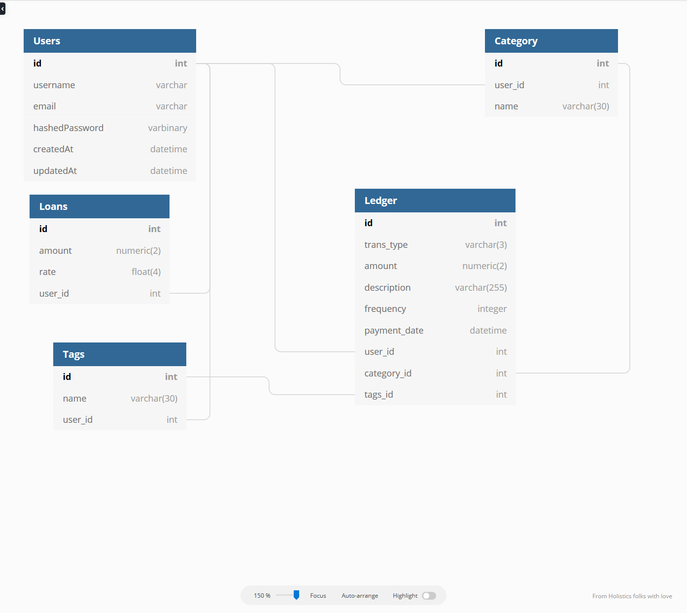

# MVPs
## Base
1. expense graph
2. expenses
3. expense tags
4. debt repayment calculator w/ explanations

## Stretch Goals:
5. Excel Uploading of expenses

# Routes

## Backend
- /api/expenses/create - POST
- /api/expenses - GET
- /api/expenses/:id = GET, PUT, DELETE
- /api/expenses/category/:id - GET, POST, DELETE

## Frontend
- /
- /expenses
- /expenses/category/:id
- /interest-calculator

# Wireframe
- https://wireframe.cc/TQrl2d
- https://wireframe.cc/9fD0c9
- https://wireframe.cc/LUWcnP

# Store Structure
```javascript
{
    user: {
        id: 1,
        username: string
    },
    expenses: {
        expenseName: [
            {
                expense_name: '',
                tag: '',
                category: '',
            }
        ]
    },
    categories: [],
}
```

# Schema

